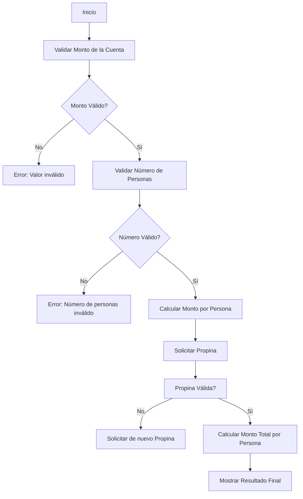

# Tip Calculator 💸

Bienvenido a **Tip Calculator**, un proyecto sencillo en Python diseñado para calcular la cantidad a pagar por persona después de añadir una propina a la cuenta. Este proyecto es ideal para repasar conceptos de Python, como el manejo de excepciones, validaciones y cálculo básico.

## Descripción

La **Tip Calculator** permite:
- Ingresar el monto total de la cuenta.
- Validar el número de personas entre las que se dividirá la cuenta.
- Sugerir un porcentaje de propina (con un mínimo del 5%).
- Calcular el monto por persona, incluyendo la propina.

Este proyecto también incluye un sistema de validación para asegurar que los valores ingresados sean correctos. Si se introducen datos inválidos, se lanzarán excepciones apropiadas.

## Características principales
- **Validación del monto**: El monto debe ser un número positivo mayor que cero.
- **Validación del número de personas**: El número de personas debe ser un número entero mayor que cero.
- **Cálculo del monto por persona**: Calcula la cantidad total a pagar por persona, incluyendo la propina.

## Instalación

Para ejecutar este proyecto, solo necesitas tener instalado Python 3.x en tu sistema. No se requieren dependencias externas.

```bash
git clone https://github.com/tu-usuario/tipcalculator.git
cd tipcalculator
python tip_calculator.py
```

## Diagrama


## Ejemplo de uso
``` 
Inserte la cuenta a pagar: 100
Introduzca el número de personas: 4
Cuánta propina queréis dar? (mínimo 5%)
Sugerencias de propina: 12, 15, 20%

Indique propina: 15

Resultado:
Cuenta:         100€
Personas:       4
Propina:        15.0€
-----------------------------------
€ por persona:  28.75€
```

